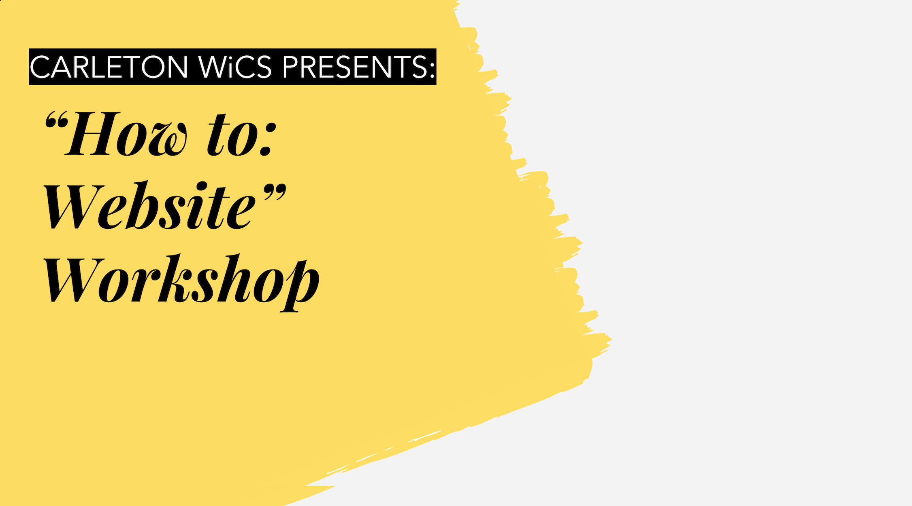

# WiCS - How to: Website Workshop 

> This repository contains a list of "materials or tools,"  instructions (or suggestions) and a base code for participants who are interested in this workshop, which will be happening on March 27, 2019 from 6:00pm to 7:30pm.  This workshop is specifically targeted to those who have no to little experience with website making but every programmer of all skill level is more than welcome to come!  

<i> The accompanying slideshow will be posted soon </i>

At the end of the workshop, I will publish my version of final product in this repository. In the workshop, I will mention possible suggestion but the sky is the limit!!  

## Purpose 

I'm surprised by the number of students (based on who I've talked to) who do not have a website (not even a website that leads to their resume!) or side projects. As a result, I decided to create this workshop so students can have a starting point or at least one side project! 

## Learning Goal  

At the end of the website, participants will be able to build a simple, static website using only HTML, CSS and vanilla JavaScript. Ideally, he or she will be able to publish the final product using Github. 

## Installation 

No installation is required outside of a editor of your choice. Simply click on clone or download the respiratory for the base code, or copy and paste (if that is your preference).  

## Tools
<b> 1. An editor of your choice (to write code in) </b> 
- I will personally be using VS Code but any editor (even Notepad!) will work since we will simply be using HTML, CSS and vanilla JavaScript. Sadly, I'm not that familiar with using other editors so I may not be able to provided technical support if this is your first attempt of making a website. 

<b> 2. A Github Account (Optional) </b> 
- If you are interested in putting your website live, you can do it for free using Github. If there is time (not likely sadly...), I will try to demonstrate using the terminal but there is very detailed instructions here (by the one and only Github :] ): https://pages.github.com/

<b> 3. Motivation to Learn </b>
- This is the most important tool you will need. Make sure you bring it! :)

## Recommended Preparation 
www.w3schools.com

> I personally recommend this website to go over some basic HTML, CSS and JavaScript syntax. This website is very detailed and has lots of examples. I will definetely be going over and commenting my code in addition to explaining the logic when I'm coding, but if you happen to even have five minutes, it will be nice going over the concepts in much more detail. Additionally, I will give out my personal tips. 

https://adam-marsden.co.uk/css-cheat-sheet

> I found this website on February 19, 2019 at around 3:30pm. This is a fantastic cheat sheet if you ever need a refresher and has syntax that I feel like is common for web development. I don't remember half the syntax so you don't have to either :) 

## Usage example

Displaying your personal, side projects and showcasting your persona in a beautiful and organized manner. 

## Other Questions? Need some help?

If you have any questions or assistance, please send it to: vu.monica.05@gmail.com with the subject line: <b> "WiCS How to: Website Workshop: Question". </b> Since I'm still a student, I will do my best to reply as quickly as I can. Feel free to use other method of communication (assuming you have my contact info for other types of media) as well!  
